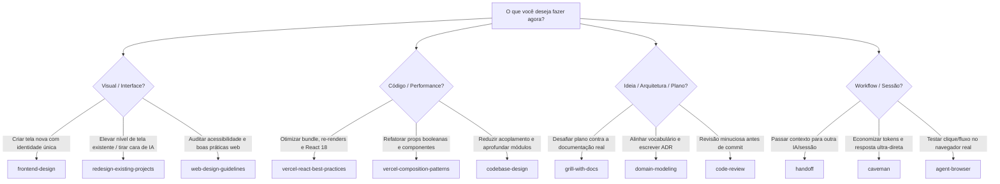

# Manual Definitivo de Skills do Workspace — Portfólio Rodrigo Melo

Este manual fornece o guia de referência operacional para as **19 agent skills** instaladas em `.agents/skills/`. Cada skill foi selecionada para transformar este repositório em um ambiente de engenharia de design de alto padrão, compatível com **Lovable.dev, Cursor, Claude Code e Antigravity**.

---

## 📑 Índice Rápido

1. [Categorias de Skills](#-categorias-de-skills)
2. [Matriz de Decisão: Qual Skill Usar Agora?](#-matriz-de-decisão)
3. [Catálogo Detalhado das 19 Skills](#-catálogo-detalhado)
   - [Design, Frontend & UI/UX](#1-design-frontend--uiux)
   - [Arquitetura, Código & Desempenho](#2-arquitetura-código--desempenho)
   - [Revisão, Desafio & Governança](#3-revisão-desafio--governança)
   - [Workflow, Notas & Ecossistema de Agentes](#4-workflow-notas--ecossistema-de-agentes)
4. [Combinações Poderosas (Skill Chaining)](#-combinações-poderosas-skill-chaining)
5. [Boas Práticas e Regras de Ouro](#-boas-práticas-e-regras-de-ouro)

---

## 🧩 Categorias de Skills

| Categoria | Skills | Objetivo Principal |
| :--- | :--- | :--- |
| **Design & UI** | `frontend-design`, `redesign-existing-projects`, `web-design-guidelines` | Refinar estética Swiss Flat, eliminar genéricos de IA, garantir WCAG AA |
| **Engenharia & Performance** | `vercel-react-best-practices`, `vercel-composition-patterns`, `codebase-design`, `improve-codebase-architecture` | Otimizar re-renders, bundle size, arquitetura modular e escalável |
| **Rigor & Decisão** | `grill-with-docs`, `grilling`, `code-review`, `domain-modeling` | Questionar premissas, auditar contra ADRs e manter vocabulário unificado |
| **Automação & Workflow** | `agent-browser`, `handoff`, `caveman`, `obsidian-vault`, `skill-creator`, `writing-for-agents`, `find-skills`, `setup-matt-pocock-skills` | Testes em navegador, transição entre sessões, notas em vault e automações |

---

## 🎯 Matriz de Decisão

---

## 📚 Catálogo Detalhado das 19 Skills

---

### 1. Design, Frontend & UI/UX

#### 🎨 `frontend-design`
- **Origem:** Anthropic Skills
- **Quando Usar:** Ao criar novos layouts, componentes visuais, telas de apresentação ou seções de impacto no portfólio.
- **Evitar Quando:** For apenas uma alteração de lógica pura de dados sem interface.
- **Exemplo de Prompt:**
  > *"Use `frontend-design` para desenhar uma seção de métricas de conformidade regulatória para o case de Limites Prudenciais, respeitando a estética Swiss Flat e tipografia Inter."*
- **Dica Prática:** A skill combate layouts previsíveis (estilo "hero genérico com 3 cards coloridos"). Ela busca tipografia expressiva, espaçamentos deliberados e hierarquia editorial.

#### ✨ `redesign-existing-projects`
- **Origem:** leonxlnx/taste-skill
- **Quando Usar:** Quando uma página ou componente parecer "genérico de template de IA", com excesso de sombras, bordas sem contraste, ou cards aninhados desnecessários.
- **Exemplo de Prompt:**
  > *"Use `redesign-existing-projects` para auditar a Home do portfólio e elevar a sofisticação visual para o nível de estúdios suíços de design."*
- **Dica Prática:** Foca em contrastes cirúrgicos da paleta Zinc, micro-interações refinadas e remoção de poluição visual.

#### ♿ `web-design-guidelines`
- **Origem:** Vercel Labs
- **Quando Usar:** Antes de publicar qualquer tela nova. Audita conformidade com padrões de acessibilidade WCAG 2.2 AA, áreas de toque em mobile, contraste de cores e semântica HTML.
- **Exemplo de Prompt:**
  > *"Revise o componente `CaseStudyDetail.tsx` com `web-design-guidelines` e verifique contraste, foco de teclado e acessibilidade para leitores de tela."*
- **Dica Prática:** Essencial para o portfólio de um designer sênior — demonstra na prática o domínio de usabilidade inclusiva.

---

### 2. Arquitetura, Código & Desempenho

#### ⚡ `vercel-react-best-practices`
- **Origem:** Vercel Labs
- **Quando Usar:** Ao desenvolver ou refatorar componentes React. Foca em eliminação de re-renders inúteis, imports eficientes, memoização consciente e otimização de imagens.
- **Exemplo de Prompt:**
  > *"Audite `src/App.tsx` e `src/pages/Home.tsx` com `vercel-react-best-practices` para garantir tempo de carregamento instantâneo."*
- **Dica Prática:** Excelente para garantir que o LCP permaneça abaixo de 2.5s conforme o ADR 0004.

#### 🧱 `vercel-composition-patterns`
- **Origem:** Vercel Labs
- **Quando Usar:** Ao criar componentes reutilizáveis (botões, modais, cartões de métricas) evitando proliferação de props booleanas (`isCompact`, `isHighlighted`, `hasIcon`).
- **Exemplo de Prompt:**
  > *"Refatore o card de estudo de caso usando `vercel-composition-patterns` com padrão de composição flexível (Compound Components)."*

#### 🏗️ `codebase-design` & `improve-codebase-architecture`
- **Origem:** Matt Pocock
- **Quando Usar:** Para desenhar módulos profundos, interfaces estáveis, e evitar código espaguete entre `src/data`, `src/pages` e componentes.
- **Exemplo de Prompt:**
  > *"Use `improve-codebase-architecture` para sugerir como desacoplar a camada de dados dos estudos de caso dos componentes de visualização."*

---

### 3. Revisão, Desafio & Governança

#### 🔥 `grill-with-docs` & `grilling`
- **Origem:** Matt Pocock
- **Quando Usar:** Antes de tomar uma decisão de design ou arquitetura. A IA assume uma postura de interrogatório técnico rigoroso, confrontando seu plano contra os ADRs e diretrizes do repositório.
- **Exemplo de Prompt:**
  > *"Use `grill-with-docs` para questionar meu plano de incluir um simulador interativo de apostas na página inicial."*
- **Dica Prática:** Impede que ideias superficiais sejam aprovadas sem justificativa de dados e conformidade regulatória.

#### 📖 `domain-modeling`
- **Origem:** Matt Pocock
- **Quando Usar:** Ao discutir ou introduzir novos termos de negócio no portfólio (ex: *Limites Prudenciais*, *Cooling-off*, *SPA/MF 1.231*), ou ao criar um novo ADR.
- **Exemplo de Prompt:**
  > *"Use `domain-modeling` para validar o termo 'Autosserviço Financeiro' e registrar sua definição em `GLOSSARY.md`."*

#### 🔍 `code-review`
- **Origem:** Matt Pocock
- **Quando Usar:** Antes de realizar um merge ou release formal. Roda revisores paralelos avaliando especificações e padrões de código.
- **Exemplo de Prompt:**
  > *"Execute `code-review` nas alterações recentes da rota `/work/:slug`."*

---

### 4. Workflow, Notas & Ecossistema de Agentes

#### 🌐 `agent-browser`
- **Origem:** Vercel Labs
- **Quando Usar:** Para interagir diretamente com páginas em execução, tirar screenshots automáticos de validação, testar responsividade e verificar fluxo real de usuário.
- **Exemplo de Prompt:**
  > *"Abra o servidor local no `agent-browser`, teste a abertura do Command Palette com Ctrl+K e tire uma captura de tela."*

#### 🤝 `handoff`
- **Origem:** Matt Pocock
- **Quando Usar:** Ao final de uma sessão longa de trabalho para resumir o estado atual e preparar o próximo agente para continuar o trabalho sem perda de contexto.
- **Exemplo de Prompt:**
  > *"Gere um relatório de `handoff` resumindo a criação das rotas React e os próximos passos para otimização de imagens."*

#### 🦴 `caveman`
- **Origem:** Julius Brussee
- **Quando Usar:** Quando você quiser respostas ultra-diretas, sem saudações, sem introduções ou explicações prolixas. Economiza tempo e tokens de contexto.
- **Exemplo de Prompt:**
  > *"Ative `caveman`. O que falta para a release v1.2?"*

#### 📓 `obsidian-vault`
- **Origem:** Matt Pocock
- **Quando Usar:** Para organizar notas de pesquisa de design, transcrições de entrevistas e referências no cofre do Obsidian com wikilinks.

#### ✍️ `writing-for-agents` & `skill-creator`
- **Origem:** Matt Pocock / Anthropic
- **Quando Usar:** Ao criar novas regras, documentar arquivos para serem consumidos por agentes ou criar uma skill personalizada para o workspace.

#### 🔍 `find-skills` & `setup-matt-pocock-skills`
- **Origem:** Vercel Labs / Matt Pocock
- **Quando Usar:** Para descobrir novas skills na comunidade ou configurar rastreadores de issues locais.

---

## ⚡ Combinações Poderosas (Skill Chaining)

Acelere o fluxo de trabalho encadeando skills em sequência:

### Combo 1: "Design de Alto Impacto à Prova de Falhas"
1. `grill-with-docs` (Estresse e valide a ideia da nova seção contra o ADR 005)
2. `frontend-design` (Gere a estrutura visual editorial Swiss Flat)
3. `web-design-guidelines` (Audite o contraste e acessibilidade da tela gerada)

### Combo 2: "Refatoração de Performance Cirúrgica"
1. `improve-codebase-architecture` (Identifique acoplamento e organize as camadas)
2. `vercel-composition-patterns` (Modularize os componentes)
3. `vercel-react-best-practices` (Otimize bundle e renderizações)
4. `code-review` (Garante que nada quebrou)

### Combo 3: "Transição Perfeita entre Lovable e Cursor"
1. *Lovable:* Crie a página visualmente e faça push.
2. *Cursor:* Use `domain-modeling` para extrair dados para `src/data/cases.ts`.
3. *Terminal:* Use `handoff` para documentar o estado antes de abrir no Antigravity.

---

## 💎 Boas Práticas e Regras de Ouro

1. **Evite Over-Prompting:** As skills contêm instruções ricas. Não precisa repetir as regras da skill no seu comando — basta chamar o nome dela e definir o objetivo de negócio.
2. **Respeite o ADR 005 em Todas as Skills:** Nenhuma skill tem autorização para introduzir chavões ou declarações sem dados no portfólio de Rodrigo Melo.
3. **Mantenha as Dependências Bloqueadas:** Sempre que instalar uma nova skill, verifique se o arquivo `skills-lock.json` foi atualizado.
