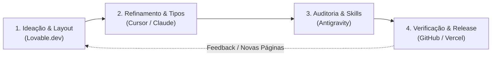

# Workflow Operacional Multi-IA — Portfólio Rodrigo Melo

Este guia estabelece o fluxo de trabalho colaborativo e sincronizado entre as ferramentas de IA utilizadas no desenvolvimento e manutenção deste portfólio: **Lovable.dev, Cursor, Claude Code e Antigravity**.

---

## 🎯 1. Visão Geral do Ecossistema

| Ferramenta | Papel Principal | Foco no Repositório | Arquivos Chave |
| :--- | :--- | :--- | :--- |
| **Lovable.dev** | Prototipagem rápida, edição visual e novos layouts | `src/pages/*`, `src/components/*` | [`PROJECT_KNOWLEDGE.md`](../PROJECT_KNOWLEDGE.md), [`src/App.tsx`](../src/App.tsx) |
| **Cursor** | Pair programming em código, refatoração e tipagem estrita | TypeScript, Tailwind, hooks e rotas | `tsconfig.json`, `src/data/cases.ts` |
| **Claude Code** | Planejamento arquitetural, escrita de ADRs e redação de conteúdo | Documentação, ADRs, compliance e storytelling | `docs/adr/*`, `GLOSSARY.md` |
| **Antigravity** | Orquestração com skills, automação via browser e governança | `.agents/skills/*`, auditorias e releases | `AGENTS.md`, `skills-lock.json` |

---

## 🔄 2. Ciclo de Desenvolvimento Integrado

### Fase 1: Criação Visual no Lovable.dev
- **Início:** Abra o repositório sincronizado no Lovable.dev.
- **Regras:**
  - O Lovable lê as diretrizes em `PROJECT_KNOWLEDGE.md` e o estilo `Modern Flat`.
  - Novos componentes devem ser colocados em `src/components/` e novas páginas em `src/pages/`.
  - Não introduzir bibliotecas desnecessárias sem atualizar o `package.json`.
- **Commit:** Lovable gera commits diretamente na branch de trabalho ou em `main`.

### Fase 2: Refatoração e Rigor Técnico (Cursor / Claude Code)
- **Ações:**
  - Puxe os commits do Lovable (`git pull origin main`).
  - Atualize `src/data/cases.ts` para dados estruturados caso novos estudos de caso sejam criados.
  - Execute checagens de tipos (`npm run build` ou `tsc --noEmit`).
  - Mantenha `GLOSSARY.md` e crie um ADR em `docs/adr/` se uma decisão estrutural for tomada.

### Fase 3: Auditoria Automatizada com Skills (Antigravity)
- **Skills Essenciais:**
  - `/web-design-guidelines`: Avalia acessibilidade WCAG 2.2 AA e usabilidade.
  - `/vercel-react-best-practices`: Audita bundle size, hooks e re-renders.
  - `/code-review`: Revisa diffs contra os padrões do repositório.
  - `npm run optimize-images`: Audita o peso de imagens em `public/images/`.

### Fase 4: Handoff e Release no GitHub
- Utilize a skill `handoff` ao transferir o contexto de uma sessão para outra.
- Use Conventional Commits (`feat:`, `fix:`, `docs:`, `refactor:`).
- Versione releases formais com tags semânticas (`git tag -a v1.2.0 -m "..."`).

---

## 📋 3. Protocolo de Handoff entre Sessões

Ao finalizar uma rodada de trabalho em uma IA e alternar para outra, siga o checklist:

1. **Estado do Código:**
   - [ ] Build passa sem erros (`npm run build`).
   - [ ] Não há referências quebradas para imagens em `public/images/`.
2. **Documentação & Domínio:**
   - [ ] Termos novos estão refletidos em `GLOSSARY.md`.
   - [ ] Decisões estruturais têm seu ADR correspondente em `docs/adr/`.
3. **Mensagem de Handoff (ou Scratch Note):**
   - Registre em `.scratch/handoff.md` ou no commit:
     - O que foi feito.
     - Próximo passo recomendado.
     - Decisões pendentes.

---

## 🛡️ 4. Quality Gates Inegociáveis

Todas as IAs devem recusar código ou texto que viole os seguintes princípios:

1. **Voz e Conteúdo (ADR 005):**
   - 🚫 **Nunca:** "Apaixonado por inovação", "Design centrado no ser humano que transforma vidas", textos genéricos sem números.
   - ✅ **Sempre:** Dados auditáveis (ex: "470 apostas/rodada (6,5x)", "Conformidade Portaria SPA/MF 1.231", "Zero multas regulatórias").
2. **Estética Swiss / Modern Flat:**
   - Cores: Monocromático Zinc (cinzas neutros), preto puro e branco.
   - Tipografia: Neo-grotesca (`Inter`).
   - Sem sombras pesadas, sem gradientes de arco-íris, sem neomorfismo.
3. **Acessibilidade:**
   - Contraste mínimo de 4.5:1 para texto normal (WCAG AA).
   - Suporte completo a navegação por teclado e leitor de tela (atributos `aria-*` e foco visível).
