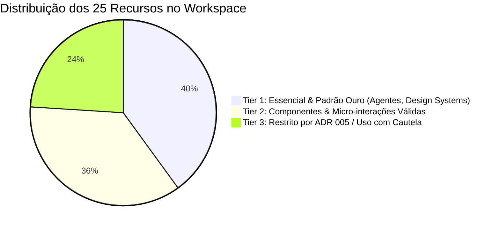

# Catálogo Curado de Recursos de Vibe Coding & UI para Agentes de IA

> **Referência Original:** Tanzil Chowdhury ([@iamtanzil_](https://x.com/iamtanzil_)) — *"25 vibe coding resources to keep you ahead of the competition"*.  
> **Filtragem & Governança:** Adaptado para o portfólio de **Rodrigo Melo** sob as diretrizes do [ADR 005 (Prova sobre Promessa / Swiss Flat)](../adr/0005-prova-sobre-promessa.md) e [A11Y.md v2.2.0 (Acessibilidade Canônica)](../a11y/A11Y.md).

---

## 🎯 1. Matriz de Relevância para o Workspace

Nem todo recurso de "vibe coding" se adequa a um portfólio sênior voltado a **fintechs, setores regulados e interfaces financeiras de alto risco**. Classificamos os 25 recursos em três níveis de aplicabilidade:



---

## 🌟 2. Tier 1: Padrão Ouro — Design Systems, Contexto de Agente & Referência Swiss

Esses recursos devem ser alimentados diretamente nos prompts do **Lovable.dev, Cursor, Claude Code e Antigravity** para garantir rigor técnico e interfaces limpas.

| # | Recurso | URL | Por que usar no nosso projeto? | Como usar nos Agentes |
| :-: | :--- | :--- | :--- | :--- |
| **1** | **DESIGNmd** | [designmd.ai](https://designmd.ai) | Sistemas de design estruturados em Markdown, ideais para persistência em contexto de IA. | Copie arquivos de regras para `.agents/` ou referencie na documentação do projeto. |
| **2** | **Component Gallery** | [component.gallery](https://component.gallery) | Mais de 2.600 exemplos de como design systems do mundo real (Gov.uk, Polaris, Carbon) resolvem cada componente. | Excelente para embasar ADRs e decisões no `A11Y-DECISIONS.md`. |
| **3** | **21st.dev** | [21st.dev](https://21st.dev) | Registro moderno de componentes que se conecta diretamente a agentes via **MCP (Model Context Protocol)**. | Conecte no Cursor/Claude via servidor MCP para injetar componentes auditados no código. |
| **4** | **Minimal Gallery** | [minimal.gallery](https://minimal.gallery) | Curadoria dos melhores sites minimalistas da web (estilo Swiss, tipográfico e neutro). | Forneça URLs de exemplo no prompt do Lovable para ancorar a geração no estilo *Swiss Flat*. |
| **5** | **Refero Styles** | [styles.refero.design](https://styles.refero.design) | Mais de 2.000 telas reais de produtos SaaS e Fintech com análise detalhada de tipografia e tokens. | Referência para hierarquia de tabelas financeiras e extratos mobile. |
| **6** | **shadcn/ui** | [ui.shadcn.com](https://ui.shadcn.com) | O padrão canônico para UI modular, acessível via Radix e estilizado com Tailwind CSS. | Base dos componentes React do projeto (`src/components/`). Total aderência ao WCAG 2.2 AA. |
| **7** | **AppShot Gallery** | [appshot.gallery](https://appshot.gallery) | Capturas reais de fluxos mobile de alta densidade (onboarding, extratos, confirmações). | Usar como benchmark para o design mobile dos casos de estudo de iGaming e transações. |
| **8** | **Kage** | [kage.design](https://kage.design) | Telas de produtos mapeadas diretamente para prompts funcionais de engenharia de UI. | Útil para gerar prompts de layout refinados no Lovable sem vícios de IA. |
| **9** | **Jiro** | [jiro.build](https://jiro.build) | Biblioteca de mais de 1.200 prompts de design otimizados para modelos de linguagem. | Extraia padrões de texto técnico para refinar as rotas de `src/pages/`. |
| **10** | **VibePrompt** | [vibeprompts.dev](https://vibeprompts.dev) | Prompts direcionados para dashboards, densidade de dados e páginas de conversão. | Ideal para iterar seções de métricas longitudinais e KPIs de produto. |

---

## ⚡ 3. Tier 2: Componentes Interativos, Animação Funcional & Micro-interações

Recursos para enriquecer a usabilidade e a percepção de polimento técnico, mantendo respeito à acessibilidade (`prefers-reduced-motion`):

| # | Recurso | URL | Aplicação Prática no Portfólio |
| :-: | :--- | :--- | :--- |
| **11** | **Motion Primitives** | [motion-primitives.com](https://motion-primitives.com) | Componentes de transição refinados para React/Framer Motion. Usar com transições discretas (150–200ms) nos cards de estudo de caso. |
| **12** | **MicroKit UI** | [microkit.co](https://microkit.co) | Micro-interações sutis (hover states em links de navegação, feedback tátil de clique). Eleva o acabamento sem gerar poluição. |
| **13** | **Magic UI** | [magicui.design](https://magicui.design) | Componentes contemporâneos em Tailwind para visualização e cards interativos. |
| **14** | **Kinetics** | [kinetics.colorion.co](https://kinetics.colorion.co) | Efeitos de movimento em React. Atenção: aplicar apenas animações funcionais que não violem WCAG SC 2.3.3. |
| **15** | **Circle Loaders** | [circleloaders.dominikakissi.com](https://circleloaders.dominikakissi.com) | Estados de carregamento limpos. Devem sempre ser acompanhados de `role="status"` e `aria-busy="true"` (conforme `guide-loading-skeleton.md`). |
| **16** | **mapcn** | [mapcn.dev](https://mapcn.dev) | Componentes de mapa se necessário no futuro para indicar sedes de operação ou escopo de licenciamento territorial. |
| **17** | **Anime.js** | [animejs.com](https://animejs.com) | Biblioteca de animação leve (sem dependências pesadas de runtime) para transições pontuais de dados numéricos. |
| **18** | **UIAble** | [uiable.com](https://uiable.com) | Catálogo de componentes rápidos prontos para copiar e colar em Tailwind. |
| **19** | **Uiverse** | [uiverse.io](https://uiverse.io) | Elementos HTML/CSS da comunidade. Filtrar para selecionar apenas itens minimalistas sem gradientes saturados. |

---

## ⚠️ 4. Tier 3: Restrições pelo ADR 005 e A11Y.md (Uso com Cautela)

Os recursos abaixo possuem tendências estéticas que **conflitam** com o posicionamento institucional de Rodrigo Melo e com o estilo *Swiss Modern Flat*:

| # | Recurso | URL | Conflito com ADR 005 / A11Y.md | Diretriz de Uso |
| :-: | :--- | :--- | :--- | :--- |
| **20** | **Gradient Buttons** | [gradientbuttons.colorion.co](https://gradientbuttons.colorion.co) | 🚫 **Conflito Direto:** ADR 005 proíbe botões coloridos de gradiente e efeitos de arco-íris. | **VETADO para ações principais.** Manter botões em Zinc 900 sólido (Light) e Zinc 100 sólido (Dark). |
| **21** | **Liquid Glass** | [glass.samasante.com](https://glass.samasante.com) | ⚠️ **Risco de Acessibilidade:** Refrações e vidros borrados frequentemente violam o contraste mínimo de 4.5:1 (WCAG SC 1.4.3). | Usar no máximo como `backdrop-blur` sutil no header fixo, com fundo semi-opaco garantido. |
| **22** | **3Dicons** | [3dicons.co](https://3dicons.co) | 🚫 **Conflito de Tom:** Ícones 3D hiper-renderizados transmitem tom lúdico/infantil incompatível com operações reguladas de compliance. | Utilizar exclusivamente ícones monocromáticos funcionais da suíte **Lucide React**. |
| **23** | **Kitbitz** | [kitbitz.art](https://kitbitz.art) | 🚫 **Conflito Estético:** Ilustrações cartunescas à mão quebram a estética brutalista neo-grotesca editorial. | Manter prova visual baseada em **telas reais de produto, mockups do Figma e dados auditáveis**. |
| **24** | **CSS Text Effects** | [text-effects.colorion.co](https://text-effects.colorion.co) | ⚠️ **Risco Cognitivo:** Textos animados ou cintilantes distraem recrutadores e prejudicam leitura veloz (WCAG SC 2.2.2). | Aplicar apenas se estritamente informativo; títulos devem permanecer nítidos e estáticos. |
| **25** | **Aceternity UI** | [ui.aceternity.com](https://ui.aceternity.com) | ⚡ **Uso Seletivo:** Muitos componentes possuem efeitos neon, fundos cósmicos ou gradientes pesados. | Extrair apenas a lógica de interação, substituindo as cores pelos tokens semânticos Zinc do projeto. |

---

## 🛠️ 5. Como Integrar Recursos nos Prompts dos Agentes

Quando for solicitar uma nova funcionalidade no **Lovable.dev** ou **Cursor**, utilize a estrutura abaixo:

```markdown
"Atue como Product Designer sênior respeitando o ADR 005 e A11Y.md v2.2.0.
Crie um componente de [NOME DO COMPONENTE] utilizando a arquitetura do shadcn/ui e Tailwind CSS.
Inspire-se na densidade de dados e simplicidade de styles.refero.design e minimal.gallery.
Regras inegociáveis:
- Paleta puramente monocromática Zinc (sem gradientes coloridos).
- Contraste WCAG 2.2 AA (mínimo 4.5:1).
- Touch target mínimo de 44x44px.
- Sem neomorfismo ou sombras pesadas."
```

---

## 🌊 6. Metodologia Scrolltide & Himanshu Hingorani ([@himanshubuildss](https://x.com/himanshubuildss))

O criador **Himanshu Hingorani** propõe uma tese central para o ecossistema de "vibe coding":
> *"Modelos de IA não falham em design de interface por falta de capacidade técnica de código, mas sim por falta de exposição prévia ao 'Design DNA' de alta qualidade e por prompts vagos."*

### O que é o Scrolltide ([scrolltide.co](https://scrolltide.co))?
Uma biblioteca e cofre com mais de 600 **Master Prompts** e templates projetados para alimentar ferramentas como **Claude Code, Lovable e Cursor**, gerando componentes animados, hero sections dinâmicas e transições orientadas por scroll (scrollytelling) em minutos.

### Como Aplicar no Portfólio de Rodrigo Melo (Filtro ADR 005 + A11Y):
1. **Scrollytelling Editorial e Restrito:**
   - Em operações reguladas (Fintech / iGaming), evite partículas e 3D cósmico. Em vez disso, use animações de scroll para **revelar dados longitudinais e etapas metodológicas** (ex: transição entre as 7 rodadas do Brasileirão ou o funil do fluxo de limites prudenciais).
2. **Respeito Obrigatório a `prefers-reduced-motion` (WCAG 2.2 SC 2.3.3):**
   - Todo master prompt de scroll ou transição deve conter a instrução explícita de desabilitar o movimento se o sistema operacional do usuário solicitar redução de movimento.
3. **Template de Master Prompt Calibrado (Scrolltide + ADR 005):**

```markdown
"Atue como Product Designer e Frontend Engineer sênior.
Construa uma seção de scrollytelling para o estudo de caso [NOME DO CASE] utilizando React, Tailwind CSS e transições suaves de opacidade/transform.
Diretrizes técnicas e estéticas:
- Design DNA: Swiss Modern Flat (Inter font, paleta Zinc 50 a 950, zero sombras pesadas).
- Acessibilidade: Contraste WCAG 2.2 AA (mínimo 4.5:1), suporte rigoroso a prefers-reduced-motion.
- Propósito da animação: Destacar a mudança de métrica de [VALOR A] para [VALOR B] conforme o usuário rola a tela.
- Código: Modular, tipado em TypeScript, sem bibliotecas pesadas de 3D."
```

